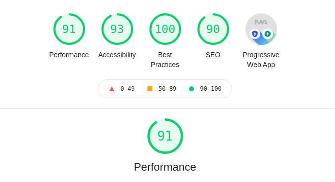
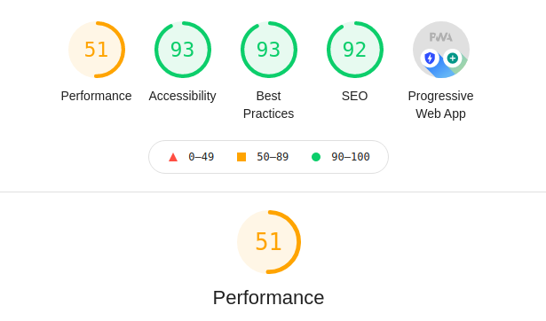

# Selecció de la API

He triat la api de unsplash. M'he generat una api key i l'he adjuntat al les cridades al servidor mitjançant el `header` des del client. No és allò ideal ja que la clau queda exposada en el codi font del client. La clau deuria d'estar a un servidor (per exemple amb node) i fer les cridades mitjançant aquell servidor intermediari, però crec que excedeix la finalitat de la pràctica.

He implementat una barra de cerca que refresca la cridada a la api al teclejar una nova paraula. He persistit la paraula a localStorage per a que no es perda al canviar de ruta.

Com que no necessitem totes les propietats que ens ofereix la api, he simplificat el model i l'he aplicat al servei `images.service.ts` per convertir el resultat que ens retorna la base de dades en el model que usarà la nostra app:

```js
getImagesByKeyWord(keyWord: string): Observable<Image[]> {
  if (keyWord === '') {
    return of([]);
  }
  return this.http.get<{results: Image[]}>
  (`${this.api_url}/search/photos?query=${keyWord}`, this.options)
    .pipe(
      map((response) => response.results || []),
      mergeMap((photos: Image[]) => of(photos.map((photo: any) => 
         new Image(photo.id, photo.description, photo.user.name, 
         photo.user.links.html, photo.created_at, photo.urls, 
         photo.color, photo.blur_hash))))
    )
}
```

Una de les propietats que he triat és la `hash_url`, ja que em sembla una opció molt interessant per fer un `placeholder` amb una representació de baixa resolució de la imatge mentre aquesta es descarrega. No obstant no he implementat aquesta `feature` per falta de temps.

# PWA

He afegit les capacitats de pwa amb `ng add @angular/pwa`.

Al fitxer de configuració generat `ngsw-config.json` he afegit la url de bootstrap per al cache de la shell i la de la api per a la cache de les dades.

```json
// (...)
"urls": [
          "https://cdn.jsdelivr.net/npm/bootstrap@5.0.
          0-beta1/dist/css/bootstrap.min.css"
        ],
// (...)
{
      "name": "assets",
      "installMode": "lazy",
      "updateMode": "prefetch",
      "resources": {
        "files": [
          "/assets/**",
          "/*.(eot|svg|cur|jpg|png|webp|gif|otf|ttf|
          woff|woff2|ani)"
        ]
      }
    }
```

Per a generar les icones de la app he usat la llibreria `ngx-pwa-icons`, d'eixa manera automatitzem la generació de totes les mides a partir d'un sol fitxer.

# Lighthouse

Aquestes són les puntuacions obtingudes per a `desktop`:



I aquestes per a `mobile`:



Aquestes darreres necessitaran optimitzacions. No obstant hi ha que tindre en compte que el test s'ha executat usant el servidor local http-server i no un servidor en producció on podem implementar entre d'altres coses compressió gzip.

# SSR

Per fer la nostra app compatible amb SSR afegim:

`ng add @nguniversal/express-engine`

En la nostra app això ens ha creat una sèrie de fitxers:

|Fitxer                    | Descripció|
|---                       | --- |
|src/                      |      |
|--main.ts                 |    bootstrapper for client app |
|--main.server.ts          |   * bootstrapper for server app |
|--app/ ...                |   application code |
|----app.server.module.ts  |   * server-side application module |
|server.ts                 |   * express web server |
|tsconfig.json             |   TypeScript base configuration |
|tsconfig.app.json         |   TypeScript browser application configuration |
|tsconfig.server.json      |   TypeScript server application configuration |
|tsconfig.spec.json        |   TypeScript tests configuration |

I després podem arrancar un servidor de ssr de desenvolupament amb:

`npm run dev:ssr`

# Desplegament a github pages

Generem el build amb:

`ng build --prod --output-path docs --base-href /unsplash-client/`

A continuació creem el fitxer `docs/404.html` amb els mateixos continguts que `docs/index.html` i configurem el repo en github.com per a que mostre la app per la següent url:

<https://jvmonjo.github.io/unsplash-client/>
